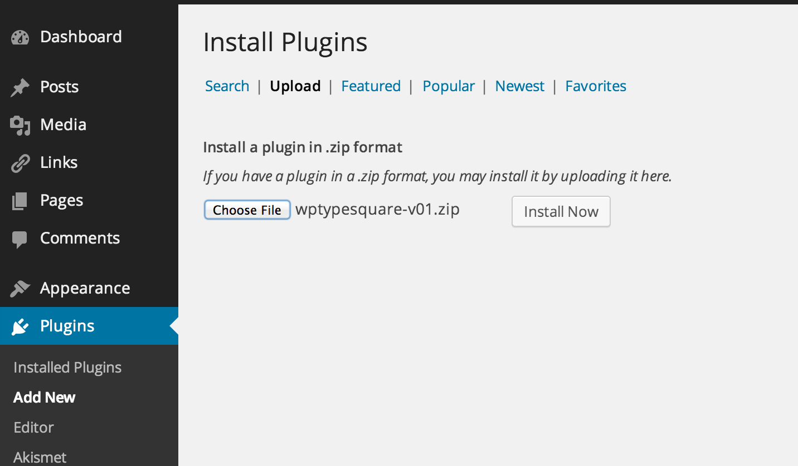

WPTypeSquare
============
This plugin make easier to use cloud fonts from [TypeSquare](http://typesquare.com) on WordPress.

VERSION HISTORY
----------------
### 0.11
add zip file.

### 0.10
First release.
Containing only non-zip php file.

HOW TO USE
----------------
1. Download
Download zip file from [here](https://github.com/kanzmrsw/WPTypeSquare/blob/master/wptypesquare-latest.zip?raw=true).

2. Install
Dashboard > Plugins > Add New > Upload > Choose wptypesquare-latest.zip > Install Now

3. Activate
4. Setting

EXAMPLES AND DEMO
----------------

LICENSE
----------------
Released under Apache 2.0 License.